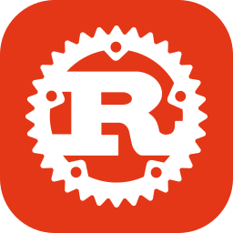

I write some garbage code every day, but I actually enjoy it.

Full-stack. Lately I've been particularly interested in Rust. I also do web front-end development, C# development, game development, and illustration.

## Familiar

